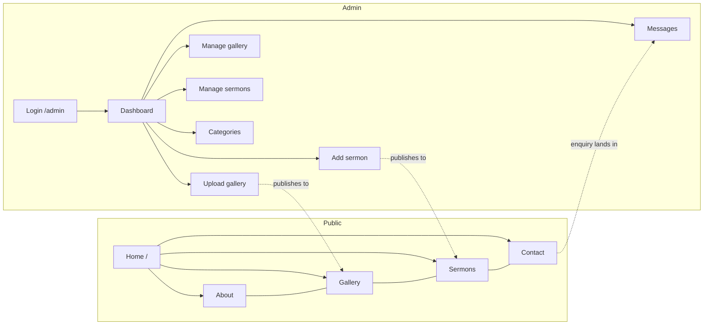
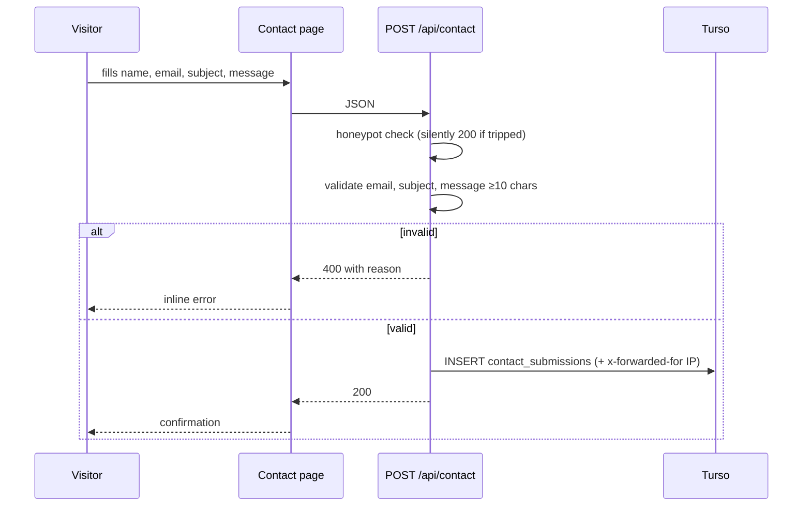
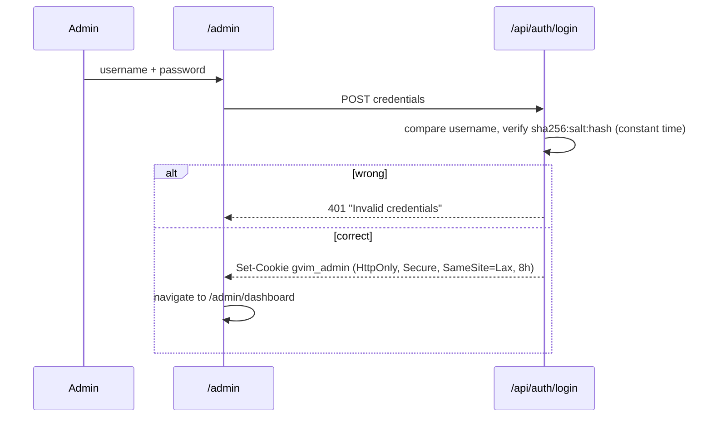
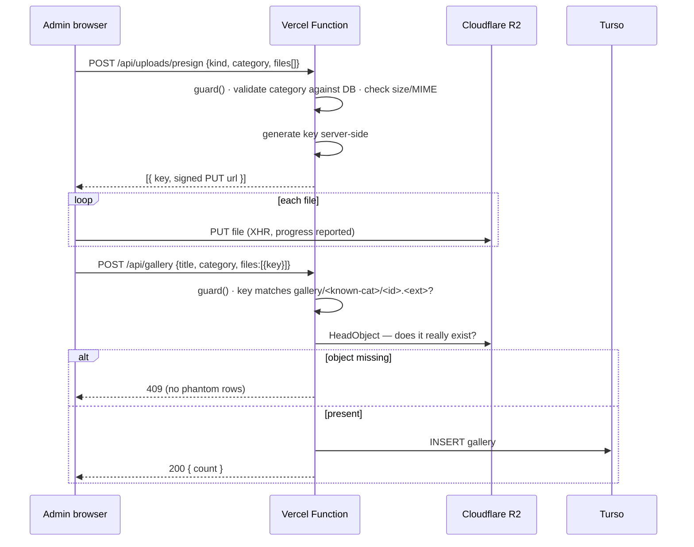

# 03 — App Flow

**Last updated:** 2026-10-08

A single React SPA. Vercel rewrites every non-`/api/*` path to `index.html`
(`vercel.json`), so React Router owns all client routing.

## 1. Route map

| Route | Screen | Auth | Data |
|---|---|---|---|
| `/` | Home | public | `GET /api/gallery?limit=6` |
| `/about` | About | public | static |
| `/gallery` | Gallery | public | `GET /api/gallery`, `GET /api/categories` |
| `/sermons` | Sermons | public | `GET /api/sermons` |
| `/contact` | Contact | public | `POST /api/contact` |
| `/admin` | Login | public | `POST /api/auth/login` |
| `/admin/dashboard` | Dashboard | **protected** | `GET /api/stats` |
| `/admin/gallery-upload` | Upload gallery | **protected** | presign → R2 → `POST /api/gallery` |
| `/admin/gallery-manage` | Manage gallery | **protected** | `GET /api/gallery`, `DELETE /api/gallery/:id` |
| `/admin/sermon-add` | Add sermon | **protected** | presign → R2 → `POST /api/sermons` |
| `/admin/sermon-manage` | Manage sermons | **protected** | `GET /api/sermons`, `DELETE /api/sermons/:id` |
| `/admin/categories` | Categories | **protected** | `GET/POST /api/categories`, `DELETE /api/categories/:slug` |
| `/admin/contacts` | Messages | **protected** | `GET /api/contacts`, `DELETE /api/contacts?id=` |

Protected routes are wrapped in `<ProtectedRoute>`, which calls `GET /api/auth/me`
and redirects to `/admin` when unauthenticated.

## 2. Navigation

Public navigation is a header bar that collapses to a hamburger below 768px.
Admin navigation is a persistent sidebar on desktop that becomes an **off-canvas
drawer below 900px**, with a scrim, Escape-to-close and body scroll lock.

## 3. Key flows

### 3.1 Visitor sends an enquiry

No email notification is sent — staff must check the admin inbox. This is the
most requested gap (`06-Implementation-Plan.md`, Phase 8).

### 3.2 Administrator signs in

The error message is identical for an unknown username and a wrong password, so
it does not reveal which was wrong.

### 3.3 Uploading photographs — the most involved flow

Media never passes through the API. The browser uploads straight to R2.

Why it is split: relaying bytes through a function means buffering the file in
memory and holding the function open for the whole transfer. The file crosses the
network once instead of twice, and the browser gets real progress. Splitting it
opens a gap — an upload with no row, or a row with no file — which is why keys are
server-generated, re-validated on commit, and the object's existence is confirmed
before any row is written.

### 3.4 Deleting content

Every destructive action routes through an in-app confirmation dialog
(`AdminFeedback`), not `window.confirm`. On confirm the API deletes the R2 object
first (failures ignored) and then the row, then a toast reports the outcome.

## 4. States every list view implements

| State | Treatment |
|---|---|
| Loading | Shimmer skeletons matching the final layout |
| Empty (no data at all) | Illustration, explanation, and a button to the action that fixes it |
| Empty (filtered to nothing) | "No matches" with the search term echoed back |
| Error | Inline alert; the page still renders |

## 5. Responsive behaviour

| Breakpoint | Public | Admin |
|---|---|---|
| ≥900px | Full nav; hero is a two-column split | Persistent sidebar |
| <900px | — | Sidebar becomes a drawer; tables become stacked cards |
| ≤768px | Header collapses to hamburger | — |
| ≤640px | Gallery filters become one scrollable row; hero buttons full width | Stat cards 2-up; quick actions stack |
