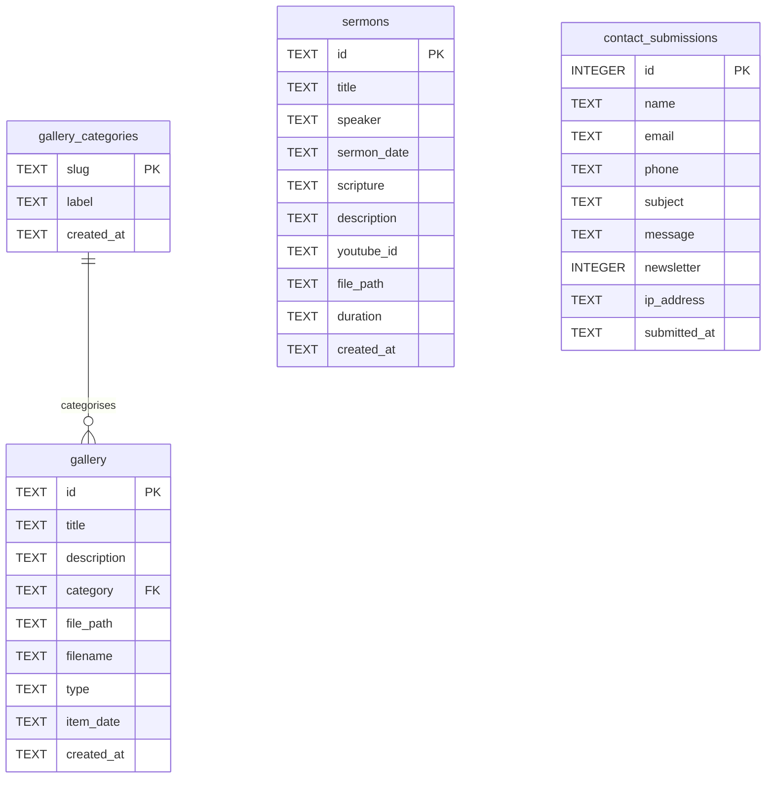

# 05 — Backend Schema & API

**Database:** Turso (libSQL / SQLite)
**Schema source of truth:** `migrations/0001_init.sql`
**Last updated:** 2026-10-08

## 1. Entity relationships



`sermons` and `contact_submissions` are intentionally standalone — neither relates
to another table.

## 2. Tables

### `gallery_categories`
| Column | Type | Notes |
|---|---|---|
| `slug` | TEXT | **PK**. URL-safe, e.g. `worship` |
| `label` | TEXT | Display name, e.g. `Worship Services` |
| `created_at` | TEXT | `datetime('now')` |

Six rows: `worship`, `events`, `outreach`, `fellowship`, `youth`, `special`.

### `gallery`
| Column | Type | Notes |
|---|---|---|
| `id` | TEXT | **PK**, 16 hex chars |
| `title` | TEXT | NOT NULL |
| `description` | TEXT | default `''` |
| `category` | TEXT | **FK** → `gallery_categories.slug` |
| `file_path` | TEXT | R2 object key, *not* a URL |
| `filename` | TEXT | Original upload name |
| `type` | TEXT | `CHECK (type IN ('image','video'))` |
| `item_date` | TEXT | Optional date of the event |
| `created_at` | TEXT | `datetime('now')` |

Indexes: `idx_gallery_category`, `idx_gallery_created`.

**`file_path` holds a key, not a URL.** The public URL is composed at read time as
`PUBLIC_GALLERY_BASE + '/' + file_path`, so the storage domain can change without
a data migration.

> **Historical quirk worth knowing.** 68 rows have `category = 'fellowship'` but a
> `file_path` under `gallery/community/…`. The category was renamed from
> `community` to `fellowship`; the database was updated for all 68 rows but only
> 29 files were moved in R2, leaving 39 rows pointing at files that did not exist
> (and 39 broken images on the old site). Resolved on 2026-08-21 by repointing all
> 68 rows at `gallery/community/`, where all 68 files are present — the prefix no
> longer matches the category slug, which is cosmetic only. 29 now-unused duplicates
> remain under `gallery/fellowship/` and can be deleted. New uploads are written as
> `gallery/<category>/<id>.<ext>` and do match.

### `sermons`
| Column | Type | Notes |
|---|---|---|
| `id` | TEXT | **PK**, 16 hex chars |
| `title` | TEXT | NOT NULL |
| `speaker`, `scripture`, `description`, `duration` | TEXT | default `''` |
| `sermon_date` | TEXT | ISO date |
| `youtube_id` | TEXT | 11-char id, extracted from any YouTube URL form |
| `file_path` | TEXT | R2 key, `''` when YouTube-only |
| `created_at` | TEXT | `datetime('now')` |

Index: `idx_sermons_date`. **Currently empty** — the feature works, no content entered.

### `contact_submissions`
| Column | Type | Notes |
|---|---|---|
| `id` | INTEGER | **PK AUTOINCREMENT** |
| `name`, `email`, `subject`, `message` | TEXT | NOT NULL |
| `phone` | TEXT | default `''` |
| `newsletter` | INTEGER | 0/1 |
| `ip_address` | TEXT | from `x-forwarded-for`, for abuse triage |
| `submitted_at` | TEXT | `datetime('now')` |

Index: `idx_contacts_date`. **Contains personal data** — exports are gitignored
(`d1-export/`).

### Conventions
- All timestamps are SQLite `datetime('now')` strings in **UTC**
  (`"2026-05-27 09:21:04"`). Safari will not parse that form directly, so
  `src/lib/format.ts` normalises the separator before constructing a `Date`.
- Booleans are INTEGER 0/1.
- IDs are 16 hex chars from `crypto.getRandomValues`, except `contact_submissions`.

## 3. API surface

All routes are Vercel Functions under `api/`, using Web-standard `Request` /
`Response`. **Auth** = requires the `gvim_admin` cookie (`guard()` in the handler).

> **Deletes use a query parameter, not a path segment.** Vercel creates one
> function per file and the Hobby plan caps a deployment at **12**. Dedicated
> `[id].ts` files for gallery, sermons and categories cost three functions for
> three DELETE handlers and pushed the project to 13, failing the deploy. Folding
> them into the collection routes brought it to 10 and matches the convention
> `/api/contacts` already used. **Adding a new file under `api/` consumes one of
> the twelve.**

| Method | Route | Auth | Purpose |
|---|---|---|---|
| POST | `/api/auth/login` | — | Sign in; sets the session cookie |
| POST | `/api/auth/logout` | — | Clears the cookie |
| GET | `/api/auth/me` | — | Reports session state (401 when absent) |
| GET | `/api/gallery` | — | List; `?category=`, `?limit=` (bound, clamped to 500) |
| POST | `/api/gallery` | ✅ | Commit uploaded media (metadata + keys) |
| DELETE | `/api/gallery?id=` | ✅ | Delete row and R2 object |
| GET | `/api/sermons` | — | List; `?limit=` |
| POST | `/api/sermons` | ✅ | Commit a sermon |
| DELETE | `/api/sermons?id=` | ✅ | Delete row and any R2 object |
| GET | `/api/categories` | — | List |
| POST | `/api/categories` | ✅ | Create (slug normalised) |
| DELETE | `/api/categories?slug=` | ✅ | Delete; **409** if still used by photos |
| POST | `/api/contact` | — | Public enquiry form |
| GET | `/api/contacts` | ✅ | List messages; `?limit=` (default 100) |
| DELETE | `/api/contacts?id=` | ✅ | Delete a message |
| GET | `/api/stats` | ✅ | Dashboard counts via `COUNT(*)` |
| POST | `/api/uploads/presign` | ✅ | Issue presigned R2 PUT URLs |

### Shared modules
| Module | Responsibility |
|---|---|
| `lib/db.ts` | Turso client exposing D1's `prepare/bind/all/first/run` shape |
| `lib/r2.ts` | R2 over the S3 API: `putObject`, `deleteObject`, `objectExists`, `presignPut` |
| `lib/util.ts` | `json`, `bad`, `guard`, JWT sign/verify, password verify, `clientIp` |

`lib/db.ts` mirrors the Cloudflare D1 API deliberately: it let every handler keep
its original SQL verbatim during the migration off Cloudflare.

### Response conventions
- Success: `200` with JSON. Errors: `{ "error": "message" }` with 400 / 401 / 404 / 409.
- `409` specifically means "referenced thing is missing or still in use" —
  committing an upload whose object is absent, or deleting a category still in use.

## 4. Upload contract

```
POST /api/uploads/presign  { kind, category?, files: [{name, type, size}] }
  → { uploads: [{ key, url, filename, contentType, type }] }
PUT  <url>                 (browser → R2 directly, exact Content-Type required)
POST /api/gallery          { title, category, files: [{key, filename, type}] }
```

Server-side rules: keys are always generated by the API; the category is validated
against the database before becoming a key prefix; max 50 MB and 50 files per
batch; gallery accepts image/video, sermons accept audio/video; presigned URLs
expire after 10 minutes; commit re-validates the key shape and confirms the object
exists via `HeadObject` before inserting.

## 5. Migrations

`migrations/0001_init.sql` is the only migration and is reused verbatim on Turso —
libSQL is SQLite, so `AUTOINCREMENT`, `datetime('now')`, `CHECK` and `FOREIGN KEY`
all work unchanged.

`scripts/migrate-d1-to-turso.mjs` (`export` / `schema` / `import` / `verify` / `all`)
handled the move off Cloudflare D1 and is retained for reference. Note it **skips
the seed INSERTs** by default: when importing a dump, the dump is authoritative and
seeding would resurrect deleted categories. Use `--seed` only on a fresh database.

### Adding a migration
There is no migration runner. Add `migrations/000N_*.sql`, apply it with
`@libsql/client`, and update this document in the same change.
